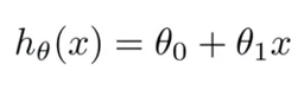
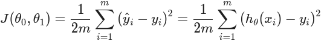
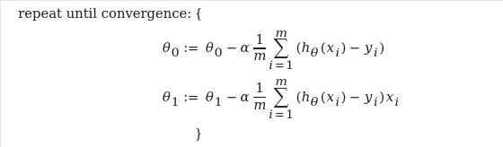

Implement simple gradient descent for linear regression.
You will have a simple dataset containing m=? points, you should implement a simple gradient decent in Python to calculate best fit for the hypnosis function. These examples are taken from Week 1 in Machine Learning course for Andrew Ng.
Your dataset is in this folder, named dataset.csv

your Hypnosis function

Your cost function

Gradient Descent

*You don't need to train a model or anything just pure math.
*Your output should be theta0 and theta1, and a plot of the model.
*You should only use python standard library except matplotlib.
*If you find anything hard, you can revise the video associated with it in the course, then in Discord.
